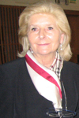
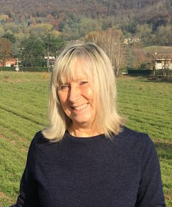
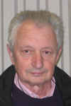

\[vc\_row css=".vc\_custom\_1560794933055{padding-bottom: 60px !important;}"\]\[vc\_column\]\[ultimate\_heading main\_heading="Esperti" el\_class="accent-border-color" main\_heading\_margin="margin-bottom:50px;"\]\[/ultimate\_heading\]\[/vc\_column\]\[/vc\_row\]\[vc\_row\]\[vc\_column width="2/3"\]\[vc\_row\_inner el\_class="box"\]\[vc\_column\_inner\]\[vc\_column\_text\] **Angela Girelli**

Consulente sanitaria

Angela Girelli è responsabile della Diabetologgia degli Spedali Civili di Brescia.  Si interessa anche della formazione del paziente, della gestione della cura e della gestione dei percorsi clinici e formativi relativi alla terapia con microinfusore. Fa parte del Gruppo di coordinamento GISED ed è stata, giovanissima, vicepresidente della AMD lombarda. Ha collaborato al volume Assistenza diabetologica in Italia. Outcomes e modelli organizzativi edito da Franco Angeli nel 2002.

\[/vc\_column\_text\]\[/vc\_column\_inner\]\[/vc\_row\_inner\]\[vc\_row\_inner el\_class="box" css=".vc\_custom\_1574149508746{margin-top: 45px !important;}"\]\[vc\_column\_inner\]\[/vc\_column\_inner\]\[/vc\_row\_inner\]\[/vc\_column\]\[vc\_column width="1/3"\]\[vc\_row\_inner el\_class="box" css=".vc\_custom\_1574149618049{margin-left: 45px !important;}"\]\[vc\_column\_inner\]\[vc\_column\_text\]\[/vc\_column\_text\]\[/vc\_column\_inner\]\[/vc\_row\_inner\]\[/vc\_column\]\[/vc\_row\]\[vc\_row css=".vc\_custom\_1560795724688{padding-top: 50px !important;}"\]\[vc\_column\]\[ultimate\_heading main\_heading="Le Sezioni Brescia e Provincia" el\_class="accent-border-color" main\_heading\_margin="margin-bottom:50px;"\]\[/ultimate\_heading\]\[/vc\_column\]\[/vc\_row\]\[vc\_row css=".vc\_custom\_1574170615100{margin-top: 45px !important;margin-bottom: 45px !important;padding-right: 35px !important;padding-left: 35px !important;background-color: #eff6e4 !important;}"\]\[vc\_column\]\[vc\_accordion\]\[vc\_accordion\_tab title="

### Sede di Brescia

"\]\[vc\_row\_inner gap="35"\]\[vc\_column\_inner width="1/2" css=".vc\_custom\_1574675992724{background-color: rgba(255,255,255,0.71) !important;\*background-color: rgb(255,255,255) !important;}"\]\[vc\_column\_text\]\[/vc\_column\_text\]\[vc\_column\_text\]

#### Edelweiss Ceccardi

Presidente

 

\[/vc\_column\_text\]\[/vc\_column\_inner\]\[vc\_column\_inner width="1/2" css=".vc\_custom\_1574675998308{background-color: rgba(255,255,255,0.71) !important;\*background-color: rgb(255,255,255) !important;}"\]\[vc\_column\_text\]

#### 

#### Luisella Rossi

Vice Presidente

\[/vc\_column\_text\]\[/vc\_column\_inner\]\[/vc\_row\_inner\]\[/vc\_accordion\_tab\]\[vc\_accordion\_tab title="

### Sezione Berlingo

"\]\[vc\_column\_text\]

**Referente**

**Magoni Giandomenico**

**cell: 333 9131325**

\[/vc\_column\_text\]\[vc\_row\_inner\]\[vc\_column\_inner css=".vc\_custom\_1574170886084{background-color: rgba(255,255,255,0.71) !important;\*background-color: rgb(255,255,255) !important;}"\]\[/vc\_column\_inner\]\[/vc\_row\_inner\]\[/vc\_accordion\_tab\]\[vc\_accordion\_tab title="

### Sezione Chiari

"\]\[vc\_row\_inner gap="35"\]\[vc\_column\_inner css=".vc\_custom\_1574170896636{background-color: rgba(255,255,255,0.71) !important;\*background-color: rgb(255,255,255) !important;}"\]\[vc\_column\_text\]**Referente**

**Uberti Maria Luisa**

**cell: 340 5682667**\[/vc\_column\_text\]\[/vc\_column\_inner\]\[/vc\_row\_inner\]\[/vc\_accordion\_tab\]\[vc\_accordion\_tab title="

### Sezione Sabbio Chiese

"\]\[vc\_row\_inner equal\_height="yes" gap="35"\]\[vc\_column\_inner css=".vc\_custom\_1574170916380{background-color: rgba(255,255,255,0.71) !important;\*background-color: rgb(255,255,255) !important;}"\]\[/vc\_column\_inner\]\[/vc\_row\_inner\]\[/vc\_accordion\_tab\]\[vc\_accordion\_tab title="

### Sezione Gavardo e Salò

"\]\[vc\_row\_inner equal\_height="yes" gap="35"\]\[vc\_column\_inner width="1/2" css=".vc\_custom\_1574170933570{background-color: rgba(255,255,255,0.71) !important;\*background-color: rgb(255,255,255) !important;}"\]\[vc\_column\_text\]\[/vc\_column\_text\]\[vc\_column\_text\]\[/vc\_column\_text\]\[/vc\_column\_inner\]\[vc\_column\_inner width="1/2" css=".vc\_custom\_1574170940716{background-color: rgba(255,255,255,0.71) !important;\*background-color: rgb(255,255,255) !important;}"\]\[vc\_column\_text\]**Referente**

**Amato Renato**

**cell: 338 7887124**\[/vc\_column\_text\]\[/vc\_column\_inner\]\[/vc\_row\_inner\]\[/vc\_accordion\_tab\]\[vc\_accordion\_tab title="

### Sezione Gardone V.T.

"\]\[vc\_row\_inner equal\_height="yes" gap="35"\]\[vc\_column\_inner width="1/4" css=".vc\_custom\_1574170809820{background-color: rgba(255,255,255,0.71) !important;\*background-color: rgb(255,255,255) !important;}"\]\[vc\_column\_text\]\[/vc\_column\_text\]\[vc\_column\_text\]

#### Efrem Panelli

Referente della Sezione Valle Trompia

\[/vc\_column\_text\]\[/vc\_column\_inner\]\[vc\_column\_inner width="1/4" css=".vc\_custom\_1574170803328{background-color: rgba(255,255,255,0.71) !important;\*background-color: rgb(255,255,255) !important;}"\]\[vc\_column\_text\]\[/vc\_column\_text\]\[vc\_column\_text\]

#### Fausta Bertazzoli

Consigliere Direttivo Associazione Diabetici Della Provincia Di Brescia Consigliere della Sezione Valle Trompia

\[/vc\_column\_text\]\[/vc\_column\_inner\]\[vc\_column\_inner width="1/4" css=".vc\_custom\_1574170815837{background-color: rgba(255,255,255,0.71) !important;\*background-color: rgb(255,255,255) !important;}"\]\[vc\_column\_text\]\[/vc\_column\_text\]\[vc\_column\_text\]

\[/vc\_column\_text\]\[/vc\_column\_inner\]\[vc\_column\_inner width="1/4" css=".vc\_custom\_1574171412658{background-color: rgba(255,255,255,0.71) !important;\*background-color: rgb(255,255,255) !important;}"\]\[vc\_column\_text\]\[/vc\_column\_text\]\[vc\_column\_text\]\[/vc\_column\_text\]\[/vc\_column\_inner\]\[/vc\_row\_inner\]\[/vc\_accordion\_tab\]\[vc\_accordion\_tab title="

### Sez. Leno

"\]\[vc\_row\_inner equal\_height="yes" gap="35"\]\[vc\_column\_inner width="1/4" css=".vc\_custom\_1574170809820{background-color: rgba(255,255,255,0.71) !important;\*background-color: rgb(255,255,255) !important;}"\]\[vc\_column\_text\]\[/vc\_column\_text\]\[/vc\_column\_inner\]\[vc\_column\_inner width="1/4" css=".vc\_custom\_1574170803328{background-color: rgba(255,255,255,0.71) !important;\*background-color: rgb(255,255,255) !important;}"\]\[vc\_column\_text\]

#### Angelo Venturini

Referente Sezione Leno

\[/vc\_column\_text\]\[/vc\_column\_inner\]\[/vc\_row\_inner\]\[/vc\_accordion\_tab\]\[vc\_accordion\_tab title="

### Sez. Palazzolo sull'Oglio

"\]\[vc\_row\_inner equal\_height="yes" gap="35"\]\[vc\_column\_inner css=".vc\_custom\_1574170809820{background-color: rgba(255,255,255,0.71) !important;\*background-color: rgb(255,255,255) !important;}"\]\[vc\_column\_text\]\[/vc\_column\_text\]\[vc\_column\_text\]

#### Giuseppe Fra

Referente Fra Giuseppe cell: 339 7624180

\[/vc\_column\_text\]\[/vc\_column\_inner\]\[/vc\_row\_inner\]\[/vc\_accordion\_tab\]\[vc\_accordion\_tab title="

### Sez. Montichiari Fernanda Nizzola

"\]\[vc\_row\_inner equal\_height="yes" gap="35"\]\[vc\_column\_inner width="1/2" css=".vc\_custom\_1574170809820{background-color: rgba(255,255,255,0.71) !important;\*background-color: rgb(255,255,255) !important;}"\]\[vc\_column\_text\]\[/vc\_column\_text\]\[vc\_column\_text\]\[/vc\_column\_text\]\[/vc\_column\_inner\]\[vc\_column\_inner width="1/2" css=".vc\_custom\_1574170803328{background-color: rgba(255,255,255,0.71) !important;\*background-color: rgb(255,255,255) !important;}"\]\[vc\_column\_text\]\[/vc\_column\_text\]\[vc\_column\_text\]

#### Renato Perillo

Referente Sezione Montichiari

\[/vc\_column\_text\]\[/vc\_column\_inner\]\[/vc\_row\_inner\]\[/vc\_accordion\_tab\]\[vc\_accordion\_tab title="

### Sez. Ome

"\]\[vc\_column\_text\]

**Referente**

**Campana Marisa**

**cell: 388 6957258**

\[/vc\_column\_text\]\[/vc\_accordion\_tab\]\[/vc\_accordion\]\[/vc\_column\]\[/vc\_row\]
