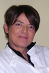
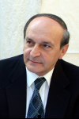

 **Angela Girelli**

Consulente sanitaria

Angela Girelli è responsabile della Diabetologgia degli Spedali Civili di Brescia.  Si interessa anche della formazione del paziente, della gestione della cura e della gestione dei percorsi clinici e formativi relativi alla terapia con microinfusore. Fa parte del Gruppo di coordinamento GISED ed è stata, giovanissima, vicepresidente della AMD lombarda. Ha collaborato al volume Assistenza diabetologica in Italia. Outcomes e modelli organizzativi edito da Franco Angeli nel 2002.

### Sede di Brescia

#### Edelweiss Ceccardi

Presidente

#### 

#### Luisella Rossi

Vice Presidente

### Sezione Berlingo

**Referente**

**Magoni Giandomenico**

**cell: 333 9131325**

### Sezione Chiari

**Referente**

**Uberti Maria Luisa**

**cell: 340 5682667**

### Sezione Sabbio Chiese

### Sezione Gavardo e Salò

**Referente**

**Amato Renato**

**cell: 338 7887124**

### Sezione Gardone V.T.

#### Efrem Panelli

Referente della Sezione Valle Trompia

#### Fausta Bertazzoli

Consigliere Direttivo Associazione Diabetici Della Provincia Di Brescia Consigliere della Sezione Valle Trompia

### Sez. Leno

#### Angelo Venturini

Referente Sezione Leno

### Sez. Palazzolo sull'Oglio

#### Giuseppe Fra

Referente Fra Giuseppe cell: 339 7624180

### Sez. Montichiari Fernanda Nizzola

#### Renato Perillo

Referente Sezione Montichiari

### Sez. Ome

**Referente**

**Campana Marisa**

**cell: 388 6957258**