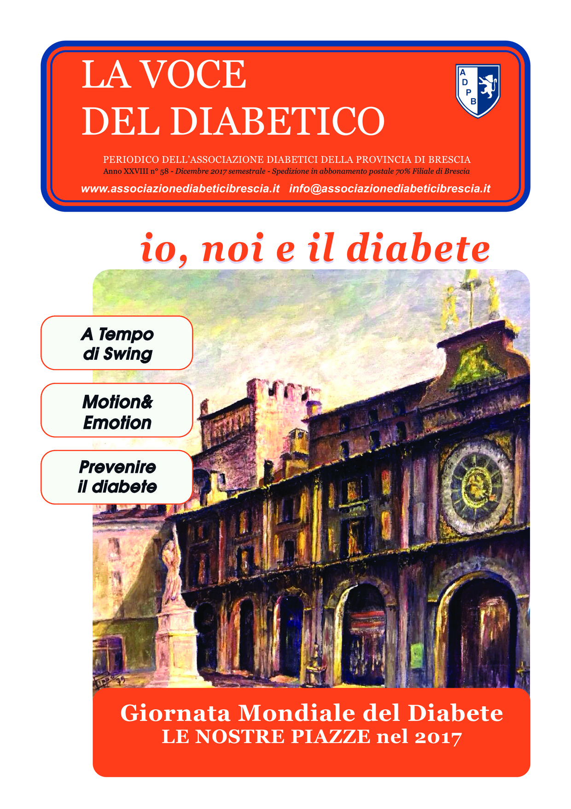

A tempo di swing. Motion & Emotion. Prevenire il diabete. Giornata mondiale del diabete.Le nostre piazze nel 2017.

<a href="/la-nostra-associazione/la-mission-dellassociazione" class="theme-btn btn-style-two">Leggi di più</a>

<!-- \[vc\_row equal\_height="yes" content\_placement="middle" css=".vc\_custom\_1560783934700{margin-right: 0px !important;margin-left: 0px !important;background-color: #f4f4f4 !important;}"\]\[vc\_column width="1/2" css=".vc\_custom\_1560781514067{padding-top: 30px !important;padding-right: 30px !important;padding-bottom: 30px !important;padding-left: 30px !important;}" offset="vc\_col-lg-4 vc\_col-md-5 vc\_col-xs-12"\]\[ultimate\_heading main\_heading="Io noi e il Diabete dicembre 2017" heading\_tag="h3" alignment="left" sub\_heading\_font\_size="desktop:20px;" sub\_heading\_line\_height="desktop:30px;" el\_class="accent-subtitle-color" main\_heading\_font\_size="desktop:30px;" main\_heading\_line\_height="desktop:40px;" sub\_heading\_margin="margin-bottom:20px;" main\_heading\_style="font-weight:bold;" main\_heading\_margin="margin-bottom:5px;"\]La voce del dibetico\[/ultimate\_heading\]\[vc\_column\_text css=".vc\_custom\_1572512731137{padding-bottom: 20px !important;}"\]A tempo di swing. Motion & Emotion. Prevenire il diabete. Giornata mondiale del diabete.Le nostre piazze nel 2017.  L’Associazione Diabetici della Provincia di Brescia, con le sue sezioni dislocate in tutta la provincia, si occupa della salute legata allo stile di vita. I mesi appena trascorsi sono stati ricchi di attività che hanno coinvolto pazienti, studenti con obiettivo di prevenzione, personale medico e sanitario di tutta la provincia, volontari sempre disponibili a partecipare alle attività. L’immagine in copertina ritrae un dipinto del mio caro papà, Piazza della Loggia, sede di tante attività di prevenzione negli anni passati.

Luisella Rossi\[/vc\_column\_text\]\[vc\_row\_inner\]\[vc\_column\_inner\]\[vc\_column\_text\]

#### [View](http://198.211.122.197/diabetwp/wordpress/wp-content/uploads/2019/10/io-noi-il-diabete-dicembre-2017-min-1.pdf) | [Download](http://198.211.122.197/diabetwp/wordpress/wp-content/uploads/2019/10/io-noi-il-diabete-dicembre-2017-min-1.pdf)

\[/vc\_column\_text\]\[/vc\_column\_inner\]\[/vc\_row\_inner\]\[/vc\_column\]\[vc\_column width="1/2"\]\[dt\_fancy\_image image\_id="2154" width="300" height="500"\]\[/vc\_column\]\[/vc\_row\]\[vc\_row\]\[vc\_column\]\[/vc\_column\]\[/vc\_row\] -->
