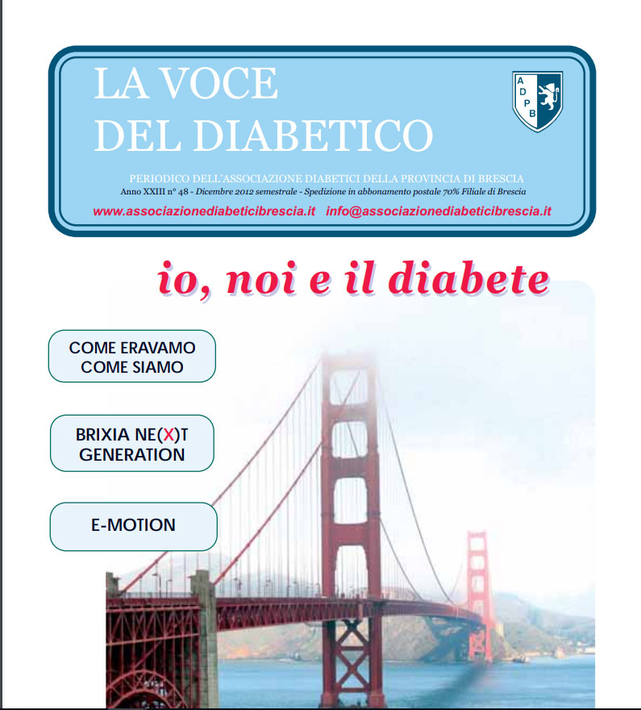

La storia dell’associazione. Regole da seguire in caso di malattia, Diabete e menopausa: CAMMINA

<a href="/la-nostra-associazione/la-mission-dellassociazione" class="theme-btn btn-style-two">Leggi di più</a>

<!-- \[vc\_row equal\_height="yes" content\_placement="middle" css=".vc\_custom\_1560783934700{margin-right: 0px !important;margin-left: 0px !important;background-color: #f4f4f4 !important;}"\]\[vc\_column width="1/2" css=".vc\_custom\_1560781514067{padding-top: 30px !important;padding-right: 30px !important;padding-bottom: 30px !important;padding-left: 30px !important;}" offset="vc\_col-lg-4 vc\_col-md-5 vc\_col-xs-12"\]\[ultimate\_heading main\_heading="Io noi e il Diabete edizione Dicembre 2012" heading\_tag="h3" alignment="left" sub\_heading\_font\_size="desktop:20px;" sub\_heading\_line\_height="desktop:30px;" el\_class="accent-subtitle-color" main\_heading\_font\_size="desktop:30px;" main\_heading\_line\_height="desktop:40px;" sub\_heading\_margin="margin-bottom:20px;" main\_heading\_style="font-weight:bold;" main\_heading\_margin="margin-bottom:5px;" margin\_design\_tab\_text=""\]La voce del diabetico\[/ultimate\_heading\]\[vc\_column\_text css=".vc\_custom\_1572953597678{padding-bottom: 20px !important;}"\]CARI LETTORI,

Per questo numero invernale abbiamo scelto come immagine di copertina il Golden Gate Bridge, il ponte che collega la città San Francisco, in California, alla vicina Sausalito. Cuore di questa edizione è l’intervista al Dottor Umberto Valentini, consulente dell’Associazione fino al 1995, che racconta la storia dell’Associazione dei Diabetici della Provincia di Brescia dalla sua nascita negli anni ’80 fino ad oggi. Dalle sue parole è evidente di come i volontari siano stati cruciali sia nella nascita dell’Associazione, che nel suo sviluppo. I volontari sono come il Golden Gate Bridge. Sono la spina dorsale che collega il passato ed il presente dell’Associazione, garantendone continuità nel tempo. La sua solidità di acciaio permette all’Associazione di muovere i suoi passi verso il futuro, sperimentando progetti sempre nuovi per aiutare i pazienti diabetici ad affrontare con serenità la malattia.

#### Federica Limone

\[/vc\_column\_text\]\[vc\_row\_inner\]\[vc\_column\_inner\]\[vc\_column\_text\]

#### [View](http://198.211.122.197/diabetwp/wordpress/wp-content/uploads/2019/11/LA-VOCE-DEL-DIABETICO-12-12.pdf) | [Download](http://198.211.122.197/diabetwp/wordpress/wp-content/uploads/2019/11/LA-VOCE-DEL-DIABETICO-12-12.pdf")

\[/vc\_column\_text\]\[/vc\_column\_inner\]\[/vc\_row\_inner\]\[/vc\_column\]\[vc\_column width="1/2"\]\[dt\_fancy\_image image\_id="2243" width="300" height="500"\]\[/vc\_column\]\[/vc\_row\] -->
