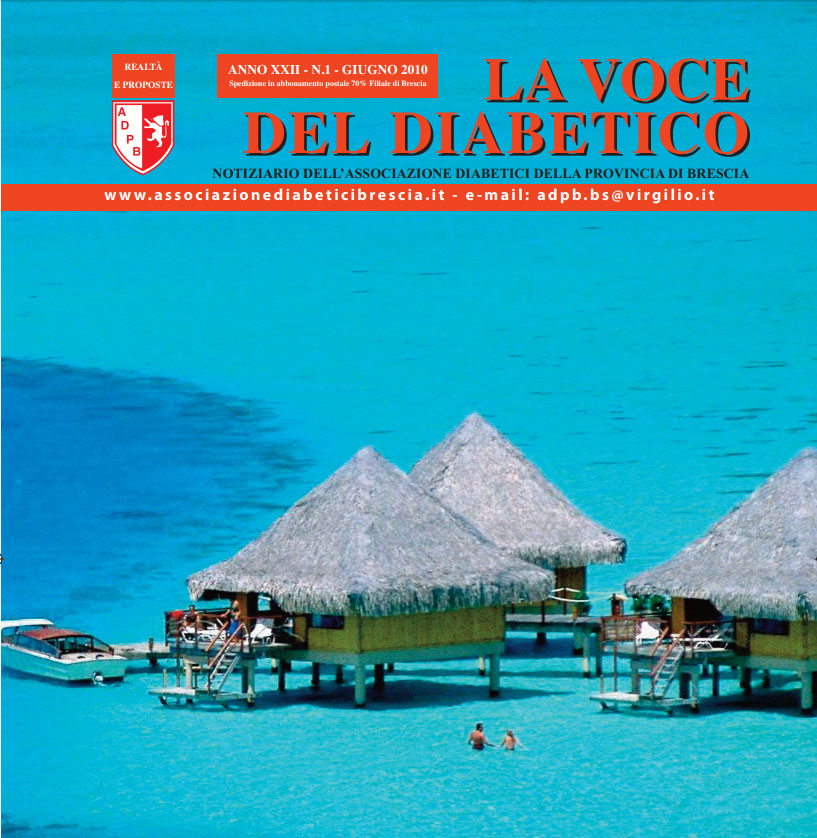

Indica nella tua dichiarazione dei redditi il codice fiscale 98007200177 GRAZIE PER IL TUO AIUTO

<a href="{{ base_url }}/la-nostra-associazione/la-mission-dellassociazione" class="theme-btn btn-style-two">Leggi di più</a>

<!-- \[vc\_row equal\_height="yes" content\_placement="middle" css=".vc\_custom\_1560783934700{margin-right: 0px !important;margin-left: 0px !important;background-color: #f4f4f4 !important;}"\]\[vc\_column css=".vc\_custom\_1560781514067{padding-top: 30px !important;padding-right: 30px !important;padding-bottom: 30px !important;padding-left: 30px !important;}" offset="vc\_col-lg-4 vc\_col-md-5 vc\_col-xs-12"\]\[ultimate\_heading main\_heading="Io noi e il Diabete edizione Giugno 2010" heading\_tag="h3" alignment="left" sub\_heading\_font\_size="desktop:20px;" sub\_heading\_line\_height="desktop:30px;" el\_class="accent-subtitle-color" main\_heading\_font\_size="desktop:30px;" main\_heading\_line\_height="desktop:40px;" sub\_heading\_margin="margin-bottom:20px;" main\_heading\_style="font-weight:bold;" main\_heading\_margin="margin-bottom:5px;"\]La voce del dibetico\[/ultimate\_heading\]\[vc\_column\_text css=".vc\_custom\_1572960109518{padding-bottom: 20px !important;}"\]CARI LETTORI,

Carissimi, la nostra associazione lavora da 30 anni per la prevenzione della patologia, per la sensibilizzazione e per il sostegno di tutti i diabetici ed ha il pregio di essere ben radicata sul territorio con uno stretto collegamento e collaborazione con le Diabetologia degli Spedali Civili di Brescia, di Gardone Val Trompia, Palazzolo, Leno, Montichiari e Gavardo, Poliambulanza, Clinica S. Rocco di Ome con ASL e le varie Istituzioni. Tra i nostri obiettivi vi è il benessere del diabetico e la prevenzione della patologia. Per favorirne il raggiungimento chiediamo ai nostri soci e a tutti i simpatizzanti di convogliare le energie nell’Associazione Diabetici della Provincia di Brescia per condividere con noi l’entusiasmo propositivo del gruppo, con la consapevolezza che la nostra forza è nello stare uniti.

#### Edelweiss Ceccardi

\[/vc\_column\_text\]\[vc\_row\_inner\]\[vc\_column\_inner\]\[vc\_column\_text\]

#### [View](http://198.211.122.197/diabetwp/wordpress/wp-content/uploads/2019/11/la_voce_giugno_2010.pdf) | [Download](http://198.211.122.197/diabetwp/wordpress/wp-content/uploads/2019/11/la_voce_giugno_2010.pdf)

\[/vc\_column\_text\]\[/vc\_column\_inner\]\[/vc\_row\_inner\]\[/vc\_column\]\[vc\_column css=".vc\_custom\_1572960323662{padding-top: 35% !important;padding-bottom: 35% !important;background-image: url(http://198.211.122.197/diabetwp/wordpress/wp-content/uploads/2019/11/voce5.jpg?id=2267) !important;background-position: center !important;background-repeat: no-repeat !important;background-size: cover !important;}" offset="vc\_col-lg-8 vc\_col-md-7 vc\_col-xs-12"\]\[/vc\_column\]\[/vc\_row\] -->
