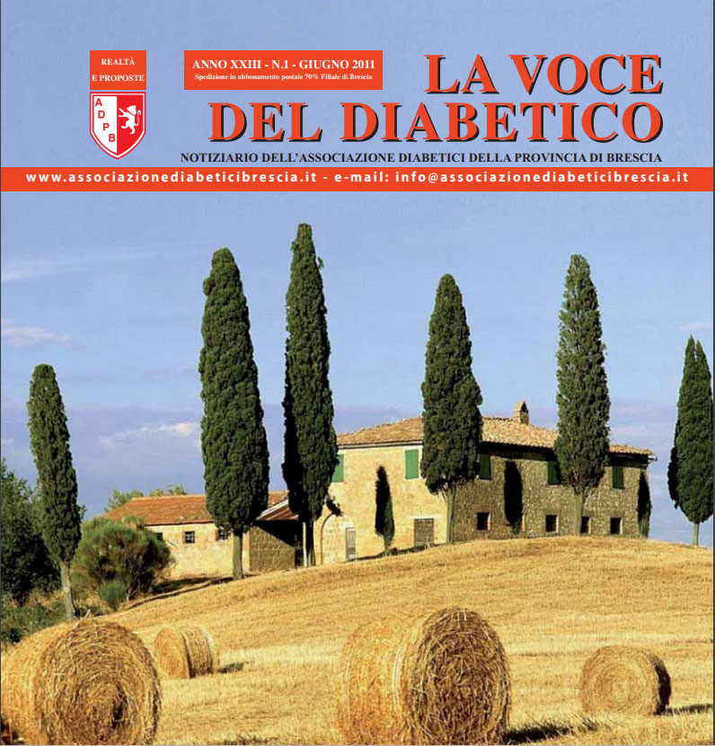

Quest’anno ci puoi aiutare destinando all’Associazione il tuo 5 ‰.

<a href="{{ base_url }}/la-nostra-associazione/la-mission-dellassociazione" class="theme-btn btn-style-two">Leggi di più</a>

<!-- \[vc\_row equal\_height="yes" content\_placement="middle" css=".vc\_custom\_1560783934700{margin-right: 0px !important;margin-left: 0px !important;background-color: #f4f4f4 !important;}"\]\[vc\_column css=".vc\_custom\_1560781514067{padding-top: 30px !important;padding-right: 30px !important;padding-bottom: 30px !important;padding-left: 30px !important;}" offset="vc\_col-lg-4 vc\_col-md-5 vc\_col-xs-12"\]\[ultimate\_heading main\_heading="Io noi e il Diabete edizione Giugno 2011" heading\_tag="h3" alignment="left" sub\_heading\_font\_size="desktop:20px;" sub\_heading\_line\_height="desktop:30px;" el\_class="accent-subtitle-color" main\_heading\_font\_size="desktop:30px;" main\_heading\_line\_height="desktop:40px;" sub\_heading\_margin="margin-bottom:20px;" main\_heading\_style="font-weight:bold;" main\_heading\_margin="margin-bottom:5px;"\]La voce del dibetico\[/ultimate\_heading\]\[vc\_column\_text css=".vc\_custom\_1572960564773{padding-bottom: 20px !important;}"\]

Carissimi, l’attività intensa di questi primi sei mesi del 2011 ha fatto sì che non mi accorgessi del passare del tempo. Gli eventi si sono succeduti con così tanta frenesia ed entusiasmo, che mi ritrovo già ad augurarVi una buona estate. Dopo i vari incontri di sensibilizzazione nelle Circoscrizioni cittadine, all’auditorium S.Barnaba, a Lumezzane, Prevalle, Padernello e Ghedi, agli screenings di prevenzione nelle piazze di Gussago, Marmentino, Salò, ai convegni -lezioni agli studenti dello Sraffa, alla partecipazione alla Marathon e alla Strabrescia, alle varie escursioni coi gruppi di cammino, sicuramente l’evento più importante è stata la nostra Assemblea Annuale, molto interessante e stimolante, di cui diamo ampio spazio più avanti. Mi scuso con i Soci che non hanno ricevuto la lettera di convocazione. Ne sono state spedite migliaia, ma purtroppo, dopo tanto lavoro, questo è stato per tutto il Direttivo una nota dolente ma involontaria. Sono molto dispiaciuta per quanto avvenuto, e sarà premura di tutti noi che ciò non possa più accadere. Per chi ne abbia la possibilità, invito a visitare il nostro sito internet, sul quale trovate notizie e testimonianze di ogni evento o a telefonarci: siamo sempre a vostra disposizione per qualsiasi evenienza e informazione. Sono lieta di comunicarVi che con il vostro contributo siamo riusciti a sostituire la vecchia auto con una nuova. Questo ci permette di trasportare il materiale per tutti i nostri eventi con maggiore tranquillità e praticità. Grazie di cuore da parte di tutto il Direttivo. Con la speranza che continuerete a sostenerci anche nel futuro Vi abbraccio e un arrivederci a presto.

#### Edelweiss Ceccardi

\[/vc\_column\_text\]\[vc\_row\_inner\]\[vc\_column\_inner\]\[vc\_column\_text\]

#### [View](http://198.211.122.197/diabetwp/wordpress/wp-content/uploads/2019/11/la-voce-giugno-2011.pdf) | [Download](http://198.211.122.197/diabetwp/wordpress/wp-content/uploads/2019/11/la-voce-giugno-2011.pdf)

\[/vc\_column\_text\]\[/vc\_column\_inner\]\[/vc\_row\_inner\]\[/vc\_column\]\[vc\_column css=".vc\_custom\_1572959928669{padding-top: 35% !important;padding-bottom: 35% !important;background-image: url(http://198.211.122.197/diabetwp/wordpress/wp-content/uploads/2019/11/voce4.jpg?id=2258) !important;background-position: center !important;background-repeat: no-repeat !important;background-size: cover !important;}" offset="vc\_col-lg-8 vc\_col-md-7 vc\_col-xs-12"\]\[/vc\_column\]\[/vc\_row\] -->
