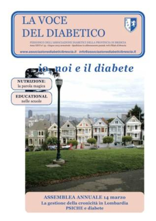

Psiche e diabete. Glicemia e autocontrollo. Leggere le etichette. Attività fisica in ospedale.

<a href="/la-nostra-associazione/la-mission-dellassociazione" class="theme-btn btn-style-two">Leggi di più</a>

<!-- \[vc\_row equal\_height="yes" content\_placement="middle" css=".vc\_custom\_1560780690544{margin-bottom: -40px !important;}"\]\[vc\_column css=".vc\_custom\_1560780876104{padding-bottom: 40px !important;}" offset="vc\_col-lg-8 vc\_col-md-7 vc\_col-xs-12"\]\[dt\_fancy\_image image\_id="2191" width="300" height="500"\]\[/vc\_column\]\[vc\_column css=".vc\_custom\_1560780882530{padding-bottom: 40px !important;}" offset="vc\_col-lg-4 vc\_col-md-5 vc\_col-xs-12"\]\[ultimate\_heading main\_heading="Io noi e il diabete Dicembre 2015" heading\_tag="h3" alignment="left" sub\_heading\_font\_size="desktop:20px;" sub\_heading\_line\_height="desktop:30px;" el\_class="accent-subtitle-color" main\_heading\_font\_size="desktop:30px;" main\_heading\_line\_height="desktop:40px;" sub\_heading\_margin="margin-bottom:20px;" main\_heading\_style="font-weight:bold;" main\_heading\_margin="margin-bottom:5px;"\]\[/ultimate\_heading\]\[vc\_column\_text css=".vc\_custom\_1572944681893{padding-bottom: 20px !important;}"\]

La fotografia in copertina ritrae le Seven Sisters di Alamo Square, a San Francisco. Le Seven Sisters sono sette case vittoriane perfettamente restaurate, tutte uguali per forma e dimensioni, ma di colori diversi, che hanno sullo sfondo i grattacieli di San Francisco. Ciò che più balza all'occhio è il contrasto tra lo stile classico delle abitazioni e la modernità dei grattacieli in secondo piano, e allo stesso tempo la loro perfetta integrazione. Anche l'Associazione Diabetici della Provincia di Brescia è così: le sue basi solide affondano le radici nel 1982, e la sua storia trentennale non è che il punto di partenza per lo sviluppo e il raggiungimento di obiettivi sempre nuovi, e per il coinvolgimento di un pubblico sempre più ampio in ottica di prevenzione e di cura.

**Federica Limone**

\[/vc\_column\_text\]\[vc\_column\_text\]

#### [View](http://198.211.122.197/diabetwp/wordpress/wp-content/uploads/2019/11/LA-VOCE-DEL-DIABETICO-maggio-2015_DARIO_Layout-1.pdf) | [Download](http://198.211.122.197/diabetwp/wordpress/wp-content/uploads/2019/11/LA-VOCE-DEL-DIABETICO-maggio-2015_DARIO_Layout-1.pdf)

\[/vc\_column\_text\]\[/vc\_column\]\[/vc\_row\] -->
