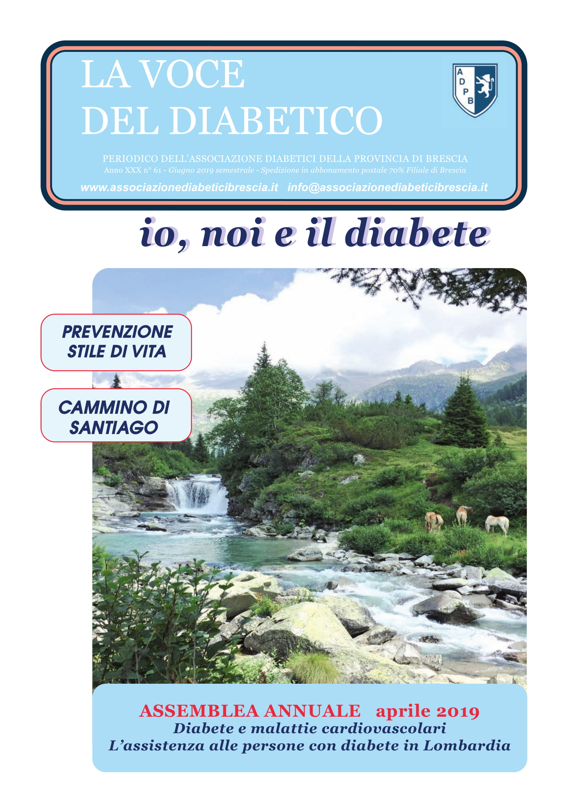

Il rinnovo del Consiglio Direttivo. Il cammino di Santiago. Il consenso informato.

\[vc\_row equal\_height="yes" content\_placement="middle" css=".vc\_custom\_1560780690544{margin-bottom: -40px !important;}"\]\[vc\_column width="1/2"\]\[ultimate\_heading\]CARI LETTORI, in questo numero abbiamo scelto come immagine di copertina la Val di Fumo, vallata di origine glaciale posta ai piedi del Carrè Alto in trentino, un luogo di nuvole e di mistero, dove nasce il fiume Chiese . L’ambiente ricco di vegetazione e di fauna è una delle nostre ricchezze, va tutelato e mantenuto incontaminato. Il nostro corpo è organizzato non per una vita sedentaria né per sforzi troppo intensi: apprendere l’arte del movimento e della sua misura è uno dei segreti per rendere il corpo resistente, associando una dieta equilibrata. Luisella Rossi\[/ultimate\_heading\]\[vc\_column\_text\][Wiew](http://198.211.122.197/diabetwp/wordpress/wp-content/uploads/2019/10/io-noi-il-diabete-maggio-2019-rid.pdf)\[/vc\_column\_text\]\[/vc\_column\]\[vc\_column width="1/2"\]\[dt\_fancy\_image image\_id="2128" width="300" height="500"\]\[/vc\_column\]\[/vc\_row\] 

#### [View](http://198.211.122.197/diabetwp/wordpress/wp-content/uploads/2019/10/io-noi-il-diabete-maggio-2019-rid.pdf) | [Download](#)