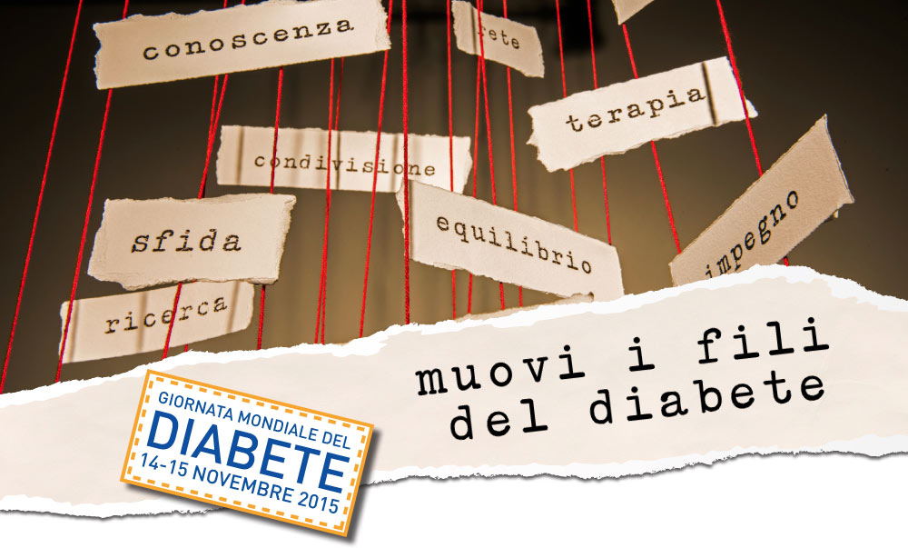

# **Giornata Mondiale del Diabete**

- Test valutazione rischio  
    
- \-Diabete tipo 2
- \-Massa muscolare

- ## **DELLO**
    

**Domenica 25 ottobre**

In collaborazione con la Diabetologia di Leno e con la Farmacia Scalvini.

- ## **BRESCIA   -  Piazza Vittoria**
    

**8 Novembre 2015**

dalle 9,00 alle 18,00

In collaborazione con la Diabetologia degli Spedali Civili di Brescia  

- ## **CHIARI (Bs) -** Piazza Martiri angolo via Villatico
    

14 Novembre 2015

dalle 8,30 alle 13,30

In collaborazione con la Diabetologia dell'Ospedale di Chiari

- ## **OME (Bs)  - c/o Oratorio**
    

15 Novembre

dalle 10,00 alle 16,00

  
In collaborazione con la Diabetologia dell'Istituto San Rocco  

- ## **MONTICHIARI (Bs)– Piazza S. Maria Assunta**
    

15 Novembre 2015

dalle 9,00 alle 13,00

  
In collaborazione con la Diabetologia dell'Ospedale di Montichiari  

- ## **INZINO (Gardone V.Trompia) Bs - Via Matteotti n° 75  
    **
    

[15 Novembre 2015](http://198.211.122.197/diabetwp/wordpress/?p=561)

dalle 8,30 alle 12,00 e dalle 14,00 alle 18,00

In collaborazione con la Diabetologia dell'Ospedale di Gardone V.T. e laFarmacia Comunale  

- ## **BRESCIA- c/o Poliambulanza- Via Bissolati 57**
    

21 Novembre 2015

dalle 9,00 alle 12,30
